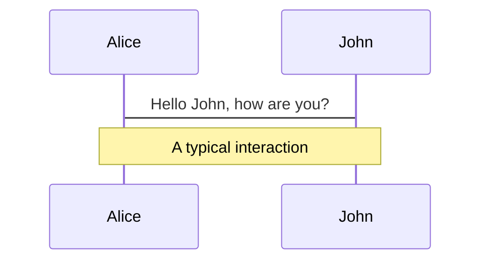
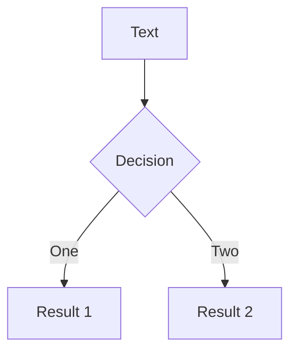
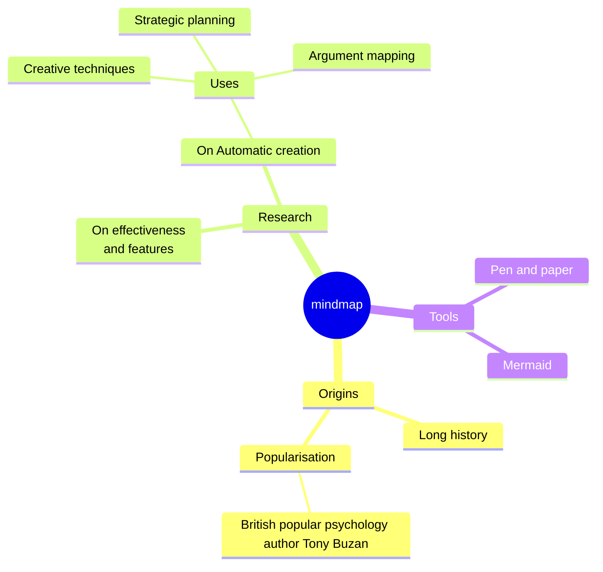
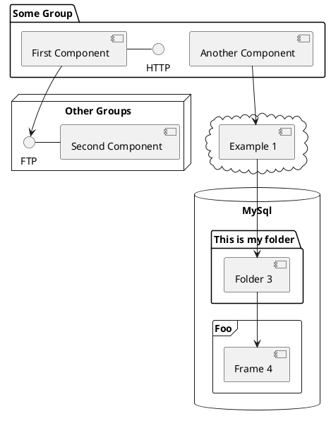

# Functional Programming with TypeScript

From First Principles to Monads

<div class="abs-br m-6 text-xl">
  <a href="https://github.com/anuchito/course-functional-programming" target="_blank" class="slidev-icon-btn">
    <carbon:logo-github />
  </a>
</div>

---

# Course Journey

1. 🧱 Foundations
   - Pure Functions & Immutability
   - First-Class & Higher-Order Functions
   - Function Composition

2. 🏗️ Building Blocks
   - Functors
   - Monads (Maybe, Either, IO)
   - Applicatives

3. 🚀 Advanced Patterns
   - Monad Transformers
   - Free Monads
   - Practical Applications

---

# What is Functional Programming?

A paradigm where programs are built by composing pure functions, avoiding shared state, and side effects

```typescript
// TypeScript with Functional Approach
type User = { id: number; name: string; email?: string };

declare const users: User[];

// Imperative (how to do it)
let activeUsers: User[] = [];
for (const user of users) {
  if (user.email) {
    activeUsers.push(user);
  }
}

// Functional (what to do)
const activeUsers = users.filter(user => user.email !== undefined);
```

---

# Core Principles in TypeScript

```typescript
// 1. Pure Functions
type Add = (a: number, b: number) => number;
const add: Add = (a, b) => a + b;  // Pure

// 2. Immutability
const numbers = [1, 2, 3];
const newNumbers = [...numbers, 4]; // New array

// 3. First-Class Functions
const operations = {
  add: (a: number, b: number) => a + b,
  multiply: (a: number, b: number) => a * b
};

// 4. Higher-Order Functions
const withLogging = <T>(fn: (...args: any[]) => T) =>
  (...args: any[]): T => {
    console.log('Calling with args:', args);
    return fn(...args);
  };
```

---

# Pure Functions in TypeScript

### Characteristics
```typescript
// Pure Function Example
type User = { id: number; name: string };

// Pure: Same input → Same output, no side effects
const formatName = (user: User): string =>
  `${user.name} (${user.id})`;

// Impure: Has side effect (console.log)
const logUser = (user: User): void => {
  console.log(`User: ${user.name}`);
};

// Impure: Relies on external state
let counter = 0;
const increment = (): number => ++counter;
```

### Benefits
- 🔍 Predictable
- 🧪 Testable
- ♻️ Cacheable
- 🧵 Thread-safe

---

# Immutability in TypeScript

### Techniques
```typescript
// 1. Readonly Types
type ImmutableUser = Readonly<{
  id: number;
  name: string;
  tags: ReadonlyArray<string>;
}>;

// 2. Deep Immutability
type DeepReadonly<T> = {
  readonly [P in keyof T]: T[P] extends object
    ? DeepReadonly<T[P]>
    : T[P];
};

// 3. Immutable Updates
const addItem = <T>(array: T[], item: T): T[] => [...array, item];
const removeItem = <T>(array: T[], index: number): T[] =>
  [...array.slice(0, index), ...array.slice(index + 1)];
```

### Libraries
- Immer
- Immutable.js
- TypeScript's `readonly`

---

# Function Composition in TypeScript

### Basic Composition
```typescript
const compose = <A, B, C>(f: (b: B) => C, g: (a: A) => B): (a: A) => C =>
  (x: A) => f(g(x));

// With multiple functions
const pipe = <T>(...fns: Array<(arg: T) => T>) =>
  (x: T) => fns.reduce((acc, fn) => fn(acc), x);
```

### Practical Example
```typescript
// Type-safe function chaining
type User = { id: number; name: string; email: string | null };

declare const getUser: (id: number) => User | null;
declare const sendEmail: (email: string) => void;

const notifyUser = (userId: number) => {
  const user = getUser(userId);
  if (user?.email) {
    sendEmail(user.email);
  }
};

// With function composition
const safeGetEmail = (user: User | null): string | null =>
  user?.email ?? null;

const notifyUser2 = pipe(
  getUser,
  safeGetEmail,
  email => email ? sendEmail(email) : null
);
```

---

# Higher-Order Functions & Functors

### Type-Safe Array Operations
```typescript
type User = { id: number; name: string; active: boolean };

const users: User[] = [
  { id: 1, name: 'Alice', active: true },
  { id: 2, name: 'Bob', active: false },
  { id: 3, name: 'Charlie', active: true }
];

// Map: User[] → string[]
const names = users.map(user => user.name);

// Filter: (User → boolean) → User[]
const activeUsers = users.filter(user => user.active);

// Reduce: (A, User) → A, A → A
const userIds = users.reduce<number[]>((acc, user) =>
  [...acc, user.id], []);
```

### Custom Functor
```typescript
class Box<T> {
  constructor(private value: T) {}

  map<U>(fn: (value: T) => U): Box<U> {
    return new Box(fn(this.value));
  }

  getValue(): T {
    return this.value;
  }
}

// Usage
const result = new Box('hello')
  .map(s => s.toUpperCase())
  .map(s => s.split('').join('-'))
  .getValue(); // "H-E-L-L-O"

---

# Monads in TypeScript

### The Maybe Monad
```typescript
class Maybe<T> {
  private constructor(private value: T | null) {}

  static of<T>(value: T | null): Maybe<T> {
    return new Maybe(value);
  }

  map<U>(fn: (value: T) => U): Maybe<U | null> {
    return this.value === null 
      ? Maybe.of<U>(null) 
      : Maybe.of(fn(this.value));
  }

  chain<U>(fn: (value: T) => Maybe<U>): Maybe<U> {
    return this.value === null 
      ? Maybe.of<U>(null)
      : fn(this.value);
  }

  getOrElse<U>(defaultValue: U): T | U {
    return this.value === null ? defaultValue : this.value;
  }
}

// Usage
const getUser = (id: number): Maybe<{ name: string }> => 
  id === 1 ? Maybe.of({ name: 'Alice' }) : Maybe.of(null);

const result = getUser(1)
  .map(user => user.name.toUpperCase())
  .getOrElse('User not found');
```

---

# Practical Monads in TypeScript

### The Either Monad for Error Handling
```typescript
type Left<L> = { kind: 'left'; value: L };
type Right<R> = { kind: 'right'; value: R };
type Either<L, R> = Left<L> | Right<R>;

const left = <L, R>(value: L): Either<L, R> => 
  ({ kind: 'left', value });

const right = <L, R>(value: R): Either<L, R> => 
  ({ kind: 'right', value });

const map = <L, R, B>(either: Either<L, R>, fn: (r: R) => B): Either<L, B> => 
  either.kind === 'right' ? right(fn(either.value)) : either;

// Usage
type User = { id: number; name: string };

declare function fetchUser(id: number): Either<string, User>;

const result = map(
  fetchUser(1),
  user => `User: ${user.name}`
);
```

### The IO Monad for Side Effects
```typescript
class IO<T> {
  constructor(private effect: () => T) {}

  static of<T>(value: T): IO<T> {
    return new IO(() => value);
  }

  map<U>(fn: (value: T) => U): IO<U> {
    return new IO(() => fn(this.effect()));
  }

  chain<U>(fn: (value: T) => IO<U>): IO<U> {
    return fn(this.effect());
  }

  run(): T {
    return this.effect();
  }
}

// Usage
const getEnv = (key: string): IO<string | undefined> => 
  new IO(() => process.env[key]);

const program = getEnv('HOME').map(home => 
  `Your home directory is ${home}`
);

console.log(program.run());

---

# Next Steps & Resources

### Practice Exercises
1. Implement `map`, `filter`, `reduce` for linked lists
2. Create a `Task` monad for async operations
3. Build a simple state management system using `Reader` monad

### Recommended Libraries
- `fp-ts` - TypeScript functional programming library
- `io-ts` - Runtime type validation
- `monet.js` - Monadic types for JavaScript
- `ramda` - Practical functional utilities

### Learning Resources
- [Mostly Adequate Guide](https://mostly-adequate.gitbook.io/mostly-adequate-guide/)
- [Functional Programming in TypeScript](https://gcanti.github.io/fp-ts/)
- [Fantasy Land Specification](https://github.com/fantasyland/fantasy-land)
- [Professor Frisby's Mostly Adequate Guide](https://github.com/MostlyAdequate/mostly-adequate-guide)

### Join the Community
- FP Discord channels
- Local meetups and conferences
- Open source contributions

## Keyboard Shortcuts

|                                                     |                             |
| --------------------------------------------------- | --------------------------- |
| <kbd>right</kbd> / <kbd>space</kbd>                 | next animation or slide     |
| <kbd>left</kbd>  / <kbd>shift</kbd><kbd>space</kbd> | previous animation or slide |
| <kbd>up</kbd>                                       | previous slide              |
| <kbd>down</kbd>                                     | next slide                  |

<!-- https://sli.dev/guide/animations.html#click-animation -->

<p v-after class="absolute bottom-23 left-45 opacity-30 transform -rotate-10">Here!</p>

---
layout: two-cols
layoutClass: gap-16
---

# Table of contents

You can use the `Toc` component to generate a table of contents for your slides:

```html
<Toc minDepth="1" maxDepth="1" />
```

The title will be inferred from your slide content, or you can override it with `title` and `level` in your frontmatter.

::right::

<Toc text-sm minDepth="1" maxDepth="2" />

---
layout: image-right
image: https://cover.sli.dev
---

# Code

Use code snippets and get the highlighting directly, and even types hover!

```ts [filename-example.ts] {all|4|6|6-7|9|all} twoslash
// TwoSlash enables TypeScript hover information
// and errors in markdown code blocks
// More at https://shiki.style/packages/twoslash
import { computed, ref } from 'vue'

const count = ref(0)
const doubled = computed(() => count.value * 2)

doubled.value = 2
```

<arrow v-click="[4, 5]" x1="350" y1="310" x2="195" y2="342" color="#953" width="2" arrowSize="1" />

<!-- This allow you to embed external code blocks -->
<<< @/snippets/external.ts#snippet

<!-- Footer -->

[Learn more](https://sli.dev/features/line-highlighting)

<!-- Inline style -->
<style>
.footnotes-sep {
  @apply mt-5 opacity-10;
}
.footnotes {
  @apply text-sm opacity-75;
}
.footnote-backref {
  display: none;
}
</style>

<!--
Notes can also sync with clicks

[click] This will be highlighted after the first click

[click] Highlighted with `count = ref(0)`

[click:3] Last click (skip two clicks)
-->

---
level: 2
---

# Shiki Magic Move

Powered by [shiki-magic-move](https://shiki-magic-move.netlify.app/), Slidev supports animations across multiple code snippets.

Add multiple code blocks and wrap them with <code>````md magic-move</code> (four backticks) to enable the magic move. For example:

````md magic-move {lines: true}
```ts {*|2|*}
// step 1
const author = reactive({
  name: 'John Doe',
  books: [
    'Vue 2 - Advanced Guide',
    'Vue 3 - Basic Guide',
    'Vue 4 - The Mystery'
  ]
})
```

```ts {*|1-2|3-4|3-4,8}
// step 2
export default {
  data() {
    return {
      author: {
        name: 'John Doe',
        books: [
          'Vue 2 - Advanced Guide',
          'Vue 3 - Basic Guide',
          'Vue 4 - The Mystery'
        ]
      }
    }
  }
}
```

```ts
// step 3
export default {
  data: () => ({
    author: {
      name: 'John Doe',
      books: [
        'Vue 2 - Advanced Guide',
        'Vue 3 - Basic Guide',
        'Vue 4 - The Mystery'
      ]
    }
  })
}
```

Non-code blocks are ignored.

```vue
<!-- step 4 -->
<script setup>
const author = {
  name: 'John Doe',
  books: [
    'Vue 2 - Advanced Guide',
    'Vue 3 - Basic Guide',
    'Vue 4 - The Mystery'
  ]
}
</script>
```
````

---

# Components

<div grid="~ cols-2 gap-4">
<div>

You can use Vue components directly inside your slides.

We have provided a few built-in components like `<Tweet/>` and `<Youtube/>` that you can use directly. And adding your custom components is also super easy.

```html
<Counter :count="10" />
```

<!-- ./components/Counter.vue -->
<Counter :count="10" m="t-4" />

Check out [the guides](https://sli.dev/builtin/components.html) for more.

</div>
<div>

```html
<Tweet id="1390115482657726468" />
```

<Tweet id="1390115482657726468" scale="0.65" />

</div>
</div>

<!--
Presenter note with **bold**, *italic*, and ~~striked~~ text.

Also, HTML elements are valid:
<div class="flex w-full">
  <span style="flex-grow: 1;">Left content</span>
  <span>Right content</span>
</div>
-->

---
class: px-20
---

# Themes

Slidev comes with powerful theming support. Themes can provide styles, layouts, components, or even configurations for tools. Switching between themes by just **one edit** in your frontmatter:

<div grid="~ cols-2 gap-2" m="t-2">

```yaml
---
theme: default
---
```

```yaml
---
theme: seriph
---
```


</div>

Read more about [How to use a theme](https://sli.dev/guide/theme-addon#use-theme) and
check out the [Awesome Themes Gallery](https://sli.dev/resources/theme-gallery).

---

# Clicks Animations

You can add `v-click` to elements to add a click animation.

<div v-click>

This shows up when you click the slide:

```html
<div v-click>This shows up when you click the slide.</div>
```

</div>

<br>

<v-click>

The <span v-mark.red="3"><code>v-mark</code> directive</span>
also allows you to add
<span v-mark.circle.orange="4">inline marks</span>
, powered by [Rough Notation](https://roughnotation.com/):

```html
<span v-mark.underline.orange>inline markers</span>
```

</v-click>

<div mt-20 v-click>

[Learn more](https://sli.dev/guide/animations#click-animation)

</div>

---

# Motions

Motion animations are powered by [@vueuse/motion](https://motion.vueuse.org/), triggered by `v-motion` directive.

```html
<div
  v-motion
  :initial="{ x: -80 }"
  :enter="{ x: 0 }"
  :click-3="{ x: 80 }"
  :leave="{ x: 1000 }"
>
  Slidev
</div>
```

<div class="w-60 relative">
  <div class="relative w-40 h-40">
    
    
    
  </div>

  <div
    class="text-5xl absolute top-14 left-40 text-[#2B90B6] -z-1"
    v-motion
    :initial="{ x: -80, opacity: 0}"
    :enter="{ x: 0, opacity: 1, transition: { delay: 2000, duration: 1000 } }">
    Slidev
  </div>
</div>

<!-- vue script setup scripts can be directly used in markdown, and will only affects current page -->
<script setup lang="ts">
const final = {
  x: 0,
  y: 0,
  rotate: 0,
  scale: 1,
  transition: {
    type: 'spring',
    damping: 10,
    stiffness: 20,
    mass: 2
  }
}
</script>

<div
  v-motion
  :initial="{ x:35, y: 30, opacity: 0}"
  :enter="{ y: 0, opacity: 1, transition: { delay: 3500 } }">

[Learn more](https://sli.dev/guide/animations.html#motion)

</div>

---

# LaTeX

LaTeX is supported out-of-box. Powered by [KaTeX](https://katex.org/).

<div h-3 />

Inline $\sqrt{3x-1}+(1+x)^2$

Block
$$ {1|3|all}
\begin{aligned}
\nabla \cdot \vec{E} &= \frac{\rho}{\varepsilon_0} \\
\nabla \cdot \vec{B} &= 0 \\
\nabla \times \vec{E} &= -\frac{\partial\vec{B}}{\partial t} \\
\nabla \times \vec{B} &= \mu_0\vec{J} + \mu_0\varepsilon_0\frac{\partial\vec{E}}{\partial t}
\end{aligned}
$$

[Learn more](https://sli.dev/features/latex)

---

# Diagrams

You can create diagrams / graphs from textual descriptions, directly in your Markdown.

<div class="grid grid-cols-4 gap-5 pt-4 -mb-6">









</div>

Learn more: [Mermaid Diagrams](https://sli.dev/features/mermaid) and [PlantUML Diagrams](https://sli.dev/features/plantuml)

---
foo: bar
dragPos:
  square: 691,32,167,_,-16
---

# Draggable Elements

Double-click on the draggable elements to edit their positions.

<br>

###### Directive Usage

```md

```

<br>

###### Component Usage

```md
<v-drag text-3xl>
  <div class="i-carbon:arrow-up" />
  Use the `v-drag` component to have a draggable container!
</v-drag>
```

<v-drag pos="663,206,261,_,-15">
  <div text-center text-3xl border border-main rounded>
    Double-click me!
  </div>
</v-drag>


###### Draggable Arrow

```md
<v-drag-arrow two-way />
```

<v-drag-arrow pos="67,452,253,46" two-way op70 />

---
src: ./pages/imported-slides.md
hide: false
---

---

# Monaco Editor

Slidev provides built-in Monaco Editor support.

Add `{monaco}` to the code block to turn it into an editor:

```ts {monaco}
import { ref } from 'vue'
import { emptyArray } from './external'

const arr = ref(emptyArray(10))
```

Use `{monaco-run}` to create an editor that can execute the code directly in the slide:

```ts {monaco-run}
import { version } from 'vue'
import { emptyArray, sayHello } from './external'

sayHello()
console.log(`vue ${version}`)
console.log(emptyArray<number>(10).reduce(fib => [...fib, fib.at(-1)! + fib.at(-2)!], [1, 1]))
```

---
layout: center
class: text-center
---

# Learn More

[Documentation](https://sli.dev) · [GitHub](https://github.com/slidevjs/slidev) · [Showcases](https://sli.dev/resources/showcases)

<PoweredBySlidev mt-10 />
